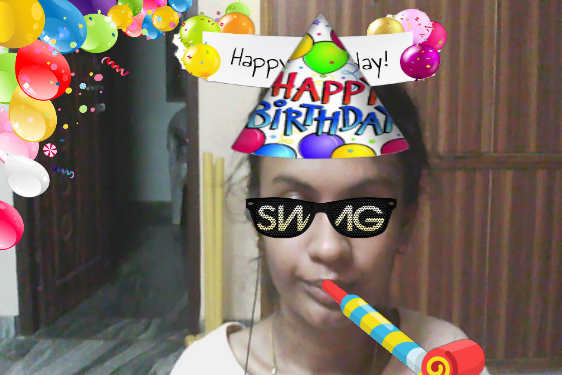
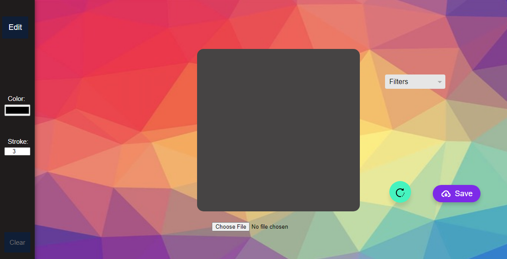
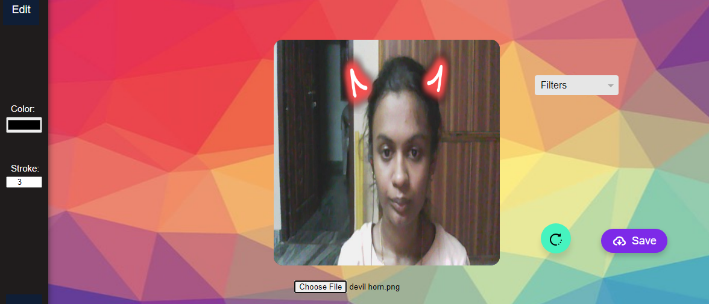
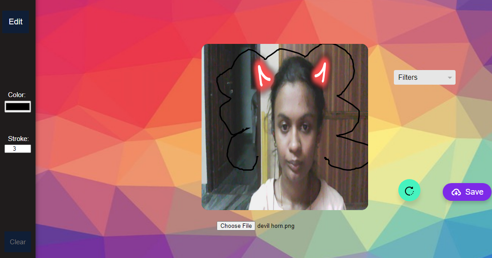

# Face-Filter-using-Face-Recognition
  ✨ This is a Web-based Application which insert filters on face.
  
  ## Web site Link -> https://geethikaaa.github.io/Face-Filter-using-Face-Recognition/
 ## Features:
    1. Inserting filters to face using face landmarks on home page.
    2. Taking snap of live webcam.
    3. Vedio recording
    4. Frames to canvas borders.
    5. Editing snap or any other photo on edit image web page.

## Requirements:

### Languages :
            
           ✨ HTML ✨
           ✨ CSS  ✨
          ✨ JAVA SCRIPT ✨
          
 ### libraries:
             ✨ P5.js ✨
            ✨ Clmtrackr ✨

## How it Works?
   
   > In P5.js in preload() function LoadImage() loads all the image filters required for the face.
   > Clmtrackr detects the face landmarks in order to insert the filters at correct position.

   >Intialisation of tracker:
   
    ✨ faceTracker = new clm.tracker();
     faceTracker.init();                          // This intialisation automatically connects face tracker to vedio input.
     faceTracker.start(videoInput.elt); ✨  
     
     
   > Then I inserted filters based on facial landmarks . They will look like this

     
  

   
  
  
  >Like this using clmtrackr we can create any type of face filter.

## Designing Project using css and style.css:

  > I add some of the addtional features to project. For that I created another web page(edit image) to my project.
It looks like this-----

In this image I added choose file button to choose any image to the canvas.If i click on that it looks like this

 
 
Edit button is used to sketch the image.

 
 
Stroke button is used to increase/decrease the size of the pen.

 
 
Filter button is used to add colourful backgrounds

 
 
Rotate button is used to rotate the image.

 
 
At last when we click on save button the edited image automatically saved in folder.

